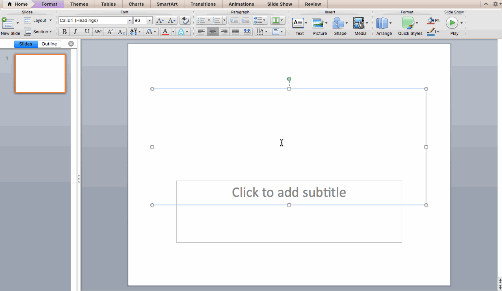

    

        
        

            
Creating goodlooking presentations in a short amount of time is a pain.

        

    

When it comes to creating presentations, the most popular tools have the most
burdensome UI. 

This distracts the user from being able to focus on the story. Creating even a
simple slide can take several unnecessary interactions. Editing the styling for
the slide is cumbersome, as each slide must be edited manually.

Why do we need such complex tools to create quick and simple presentations?

## Taking away the UI 
Text-only solutions for creating presentation slide decks without a UI are not
new, but often require advanced code with HTML, or its design is stuck in the
nineties. For those of us with an eye for design, the solution is gitslides.

Now, the only thing you need to think about is the content itself.

GitSlides utilizes the popular markup language `markdown`. A syntax that was
specifically designed to take away markup-distractions from the content.
Markdown is currently supported by Github, StackOverflow, Tumblr and WikiPedia
and seems to be the trending default for formatting.

You won’t need to study any new knowledge if you’re already familiar with
Markdown. New slides are simply created by adding a new `#heading`, just as if
you were writing a normal markdown file.

## Design 
Having zero design/font/color specifications allows you to easily switch themes
or have a controllable cross company slide deck theme with a logo and company
colors.

Existing themes can be easily incorporated and edited using gitslides.

## Staying flex with HTML 
Built on top of the popular presentation framework [Reveal.js] and with
intelligent parsing within gitslides, you can _still_ use HTML within your
markdown, separating it with a line-break. Almost as if it were the same
language.

## Git 
As the name suggests, this text-only system ensures seamless integration
with git to support fluent collaboration.  Team-mates can make edits and
changes to the deck can easily be reviewed and optionally merged into a master
slide.

## Shareable: internally or on GitHub pages 
Each deck is hosted internally on a git-server or publicly on github-pages.
Simply fork this project on GitHub and create a file in your `./_slides/` or
`._posts` folder. You can already view your presentation on
`yourusername.github.io/slides/slides/name-of-your-file`.

## PDF is your friend 
Need to upload your deck, put it on slideshare or share it by email? Export
your deck by clicking the print button and opt for save-as-pdf. 

# How to get started

## Fork this project to create your own slides directory 
This project is
[hosted on GitHub](https://github.com/riichard/slides/). Start creating
markdown slides by forking this project and triggering a commit to your fork,
you can host your own gitslides directory. All your slides will be viewable on
`yourusername.github.io/slides/`.  Add all your HTML/markdown slides to the
`slides` folder and they will automatically be listed on the front page.

<iframe
src="https://ghbtns.com/github-btn.html?user=riichard&repo=slides&type=fork&count=true&size=large"
frameborder="0" scrolling="0" width="158px" height="30px"></iframe> To get started with your own slides repo!
