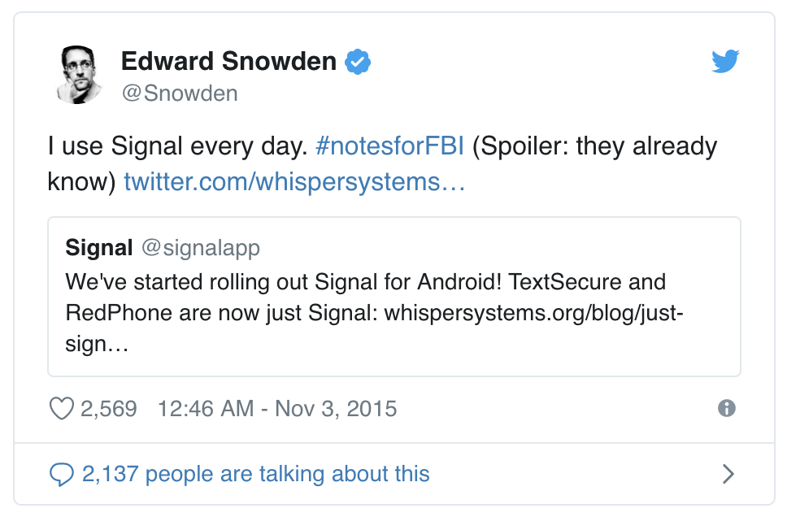

## In short

```
Email: stdin@riichard.com (see GnuPGP key below)
Phone: +316147570004 (I prefer Signal over WhatsApp over Text/SMS)
```

#### GnuPGP Public key -  [Download my key here](/pubkey.riichard.acs).

-------

## Texting

I prefer using Signal over WhatsApp. It's free, open-source, not-facebook, and
also used by Snowden. Download [Signal Messenger here](https://www.signal.org/).

[][snowdentweet]

## Email

[][protonmail]

Contact me on `stdin@riichard.com`. For private emailing, you can [download my GnuPGP key here][pgpkey].

To encrypt the email content you can use PGP. 
- [Install GPGTools for MacOSX][gpgtools]
- [Install Gpg4Win for Windows][gpg4win]
- [Install Enigmail for Ubuntu][enigmail]

#### Setup PGP easily with ProtonMail

If you'd like to contact me privately, but setting up encryption with PGP would
be too much, you can create an account on ProtonMail. For full anonymity,
you can even [install TOR Browser][torbrowser], or even [tails][tails], and create an anonymous email address via
[their onion address][protonmailonion].

Any email to `stdin@riichard.com` would then be automatically encrypted.


## Key signing

When we meet in person, I'd be happy to verify your PGP key. Please bring your
government issued ID, and a hashed fingerprint of your key. I'll then send you
an encrypted key signature. 

I'd appreciate it if you were to return the favor, and upload the signature to a well-trusted key server for our [key statistics][keystatistics].

#### Signing policy

Read more about [my key signing policy here][signingpolicy].


```
---------------------------------
pub   rsa4096 2017-03-01 [SC]
      E08799AA5747249480C2EF7D1BD95BD9E18474D1
uid           [ultimate] Richard Kraaijenhagen <stdin@riichard.com>
sub   rsa4096 2017-03-01 [E]
---------------------------------
```

Please be aware that my ProtonMail key is different than my GnuPGP key. They
can both be used, but my preference goes to my own GnuPGP key.

### GnuPGP Public key -  [Download my key here](/pubkey.riichard.acs).


[pgpkey]: /pubkey.acs
[gpgtools]: https://gpgtools.org
[enigmail]: https://www.enigmail.net/index.php/en/
[gpg4win]: https://www.gpg4win.org
[tails]: https://tails.boum.org
[torbrowser]: https://torproject.org/
[protonmail]: https://protonmail.com/
[protonmailonion]: https://protonirockerxow.onion/
[snowdentweet]: https://twitter.com/Snowden/status/661313394906161152
[signingpolicy]: /openpgp-keysigning-policy.txt
[keystatistics]: https://pgp.cs.uu.nl/stats/1bd95bd9e18474d1.html
